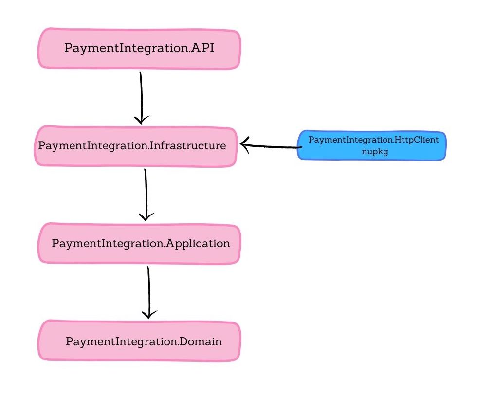

# Payment Integration Application Documentation

## Project Architecture

A clean architectural structure is followed in the project architecture. Figure 1 shows the layers of the project structure.


Figure 1
## Setup

- Since the project needs _PaymentIntegration.HttpClient_ package from <https://nuget.pkg.github.com/beyzaaydogan/index.json>, Nuget.config file has 2 sources, and one of them is GitHub. Before running the project, a personal access token should be added.

1. Generate personal access token: <https://github.com/settings/tokens>
2. Add personal access token to local machine
```
$ dotnet nuget add source \

--username YOUR_GITHUB_USERNAME \

--password YOUR_GITHUB_PAT \

--store-password-in-clear-text \

--name github \

"<https://nuget.pkg.github.com/beyzaaydogan/index.json>"
```
There are two ways to run the application: direct running (dotnet run) or using Docker Compose.

1. In direct running:

Before running the application on the local machine, first, MongoDB should be up and running.
```
$ docker run -d \

--name mongodb-local \

-p 27018:27017 \

-v mongodb_local_data:/data/db \

mongo
```
1. Running with Docker Compose

First, create an .env file in the directory where the .sln and the Docker Compose file exist, with these 2 lines:
```
GITHUB_PAC= github access token

GITHUB_USERNAME= github username
```
Then run on the same path:
```
$ docker compose up
```
## PaymentIntegration.HttpClient

This is a NuGet package, it is stored and versioned in the GitHub package registry, and used in the PaymentIntegration project. BalanceManagementAPI’s HTTP client is implemented in that package and can be used in any project needed. BalanceManagement API Client class and interface are generated using NSwag.

Required command to generate client:
```
$ nswag openapi2csclient /input:BalanceManagementApi.1.0.0.json /output:BalanceManagementApiClient.cs /classname:BalanceManagementApiClient /generate-interfaces:true
```
BalanceManagementApi.1.0.0.json file is taken from the <https://balance-management-pi44.onrender.com/api-docs>

To use this library in the project, first, the package must be installed. (Package installation is done using a GitHub personal access token.)

Then should be added to DI as follows:

builder.Services.AddBalanceManagementApiClient("<https://balance-management-pi44.onrender.com>");

Also, a retry policy can be added as an optional parameter.
```
builder.Services.AddBalanceManagementApiClient(builder.Configuration\["BalanceManagementAPI"\],

client =>

{

client.AddPolicyHandler(Policy

.HandleResult&lt;HttpResponseMessage&gt;(r => r.StatusCode == HttpStatusCode.InternalServerError)

.WaitAndRetryAsync(3, retryAttempt => TimeSpan.FromSeconds(2),

onRetry: (outcome, timespan, retryAttempt, context) =>

{

logger.LogInformation(

$"Retry attempt {retryAttempt} after {timespan.TotalSeconds}s due to HTTP 500 from {outcome.Result?.RequestMessage?.RequestUri}"

);

}));

});
```
## PaymentIntegration.API

**Controllers:**

- **OrdersController**: Used for payment operations of the orders.
- **ProductsController**: Used for product operations.

**Middlewares:**

- **HttpLoggingMiddleware**: Used for logging incoming HTTP requests
- **ValidationMiddleware**: Used for validating the HTTP request models. This is a generic validation middleware. Applies validation operation for POST and PUT requests. Instead of validating each request model in the endpoint, this approach is used. It takes validators from the service provider added to the DI, which are of type IValidator, and based on the model type, it applies the validation operation.

Validators and middlewares added to DI are shown below:
```
builder.Services.AddValidatorsFromAssemblyContaining&lt;CreatePreOrderRequestValidator&gt;();

app.UseMiddleware&lt;HttpLoggingMiddleware&gt;();

app.UseMiddleware&lt;ValidationMiddleware&gt;();
```
## PaymentIntegration.Infrastructure

In the infrastructure layer, all the logic is implemented. In this layer, DB operations and requests to other APIs are handled.

Controllers use service classes, and service classes are implemented in the infrastructure layer. There are two service classes, one for payment operations and one for product operations.

- **Mappings:** AutoMapper v14.0.0 is used for mapping operations. 2 mapping profiles are created. PaymentMappingProfile and ProductMappingProfile.
- **MongoDB:** MongoDB is used for storing payments. When the system gets a create pre-order request, payment is created in MongoDB, and the Status is _pending_ initially. While the complete order request is processing, the status is updated to _processing_ first, then if the Balance Management API returns success, the status is set to _completed_. Database operations are performed in the repository class.

The payment entity is shown below:
```
public class Payment

{

public string Id { get; set; } = null!;

public string OrderId { get; set; } = null!;

public double Amount { get; set; }

public DateTime CreatedAt { get; set; }

public DateTime UpdatedAt { get; set; }

public PaymentStatus Status { get; set; }

}
```

- **MongoMigrationRunner:** Migration runner is used for applying manually generated migrations. There is a MigrationHistory table in MongoDB; if the migration is applied, it is stored in the table. There is one migration currently generated, AddOrderIdIndexMigration, which is for applying the uniqueness operation to the OrderId field in the payment. The RunMigrations method takes migrations as an IEnumerable.

How it is added to the DI container is shown below:

```
builder.Services.AddTransient&lt;MongoMigrationRunner&gt;();

using (var scope = app.Services.CreateScope())

{

var migrations = new List&lt;IMongoDbMigration&gt;

{

new AddOrderIdIndexMigration(),

};

var runner = scope.ServiceProvider.GetRequiredService&lt;MongoMigrationRunner&gt;();

await runner.RunMigrationsAsync(migrations);

}
```

## PaymentIntegration.Application

In the application layer, interfaces, request-response models, and validators are implemented. There is a base response model implemented and used for each endpoint. For the validation, FluentValidation v12.0.0 is used.

## PaymentIntegration.Domain

In the domain layer, entities and enums are created.

## PaymentIntegration.Tests

xunit and Moq packages are used in the test project.

## Other Details

- **/health & /health/ready**

Healthcheck endpoints are added. MongoDB is added for healtcheck readiness.
```
builder.Services.AddHealthChecks()

.AddMongoDb(

clientFactory: sp => sp.GetRequiredService&lt;IMongoClient&gt;(),

databaseNameFactory: _ => builder.Configuration\["MongoDB:DatabaseName"\],

name: "mongodb",

tags: new\[\] { "readiness" },

timeout: TimeSpan.FromSeconds(5)); 
```

- **/metrics**

Metrics endpoint is added for getting the metrics of the application. To start running prometheus, the command below needs to be executed in the directory where prometheus.yml exists. Then to reach prometheus ui, go to localhost:9090.

```

$ docker run -d \

-p 9090:9090 \

-v ./prometheus.yml:/etc/prometheus/prometheus.yml \

--name prometheus \

prom/prometheus
```
##